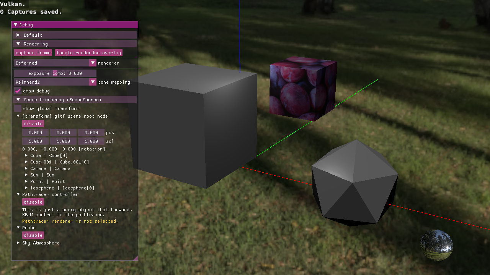
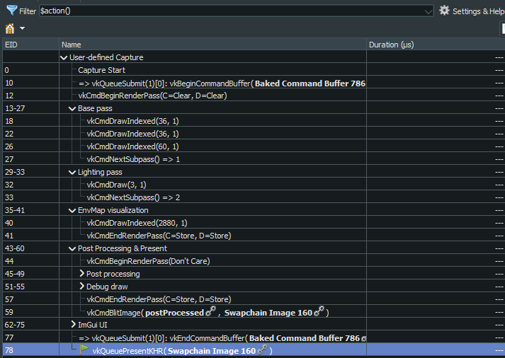
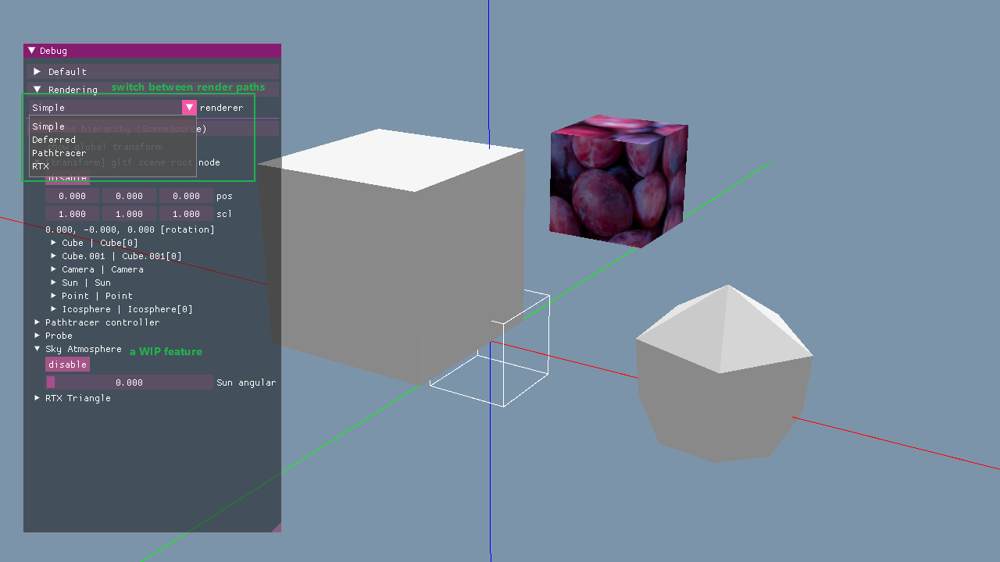
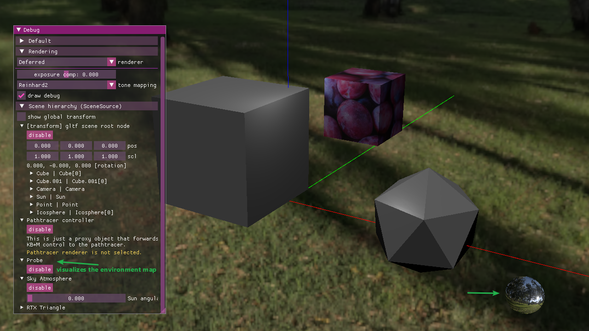
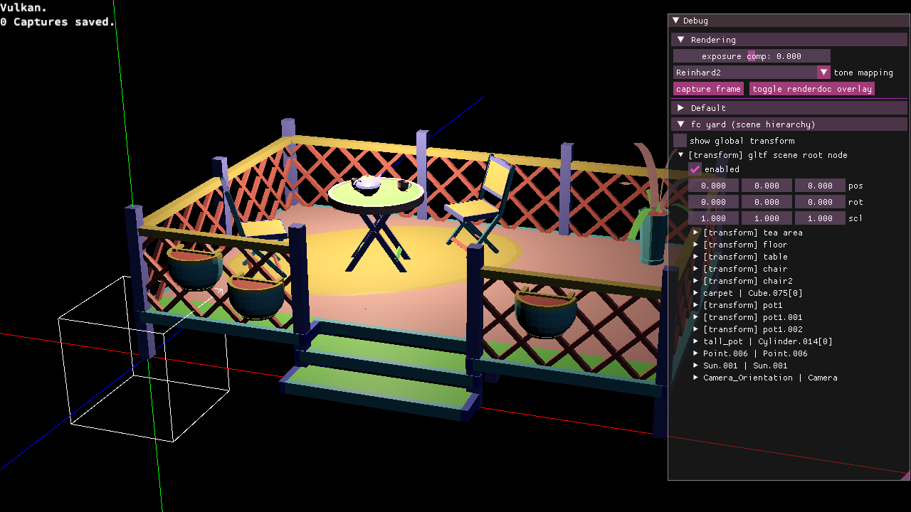
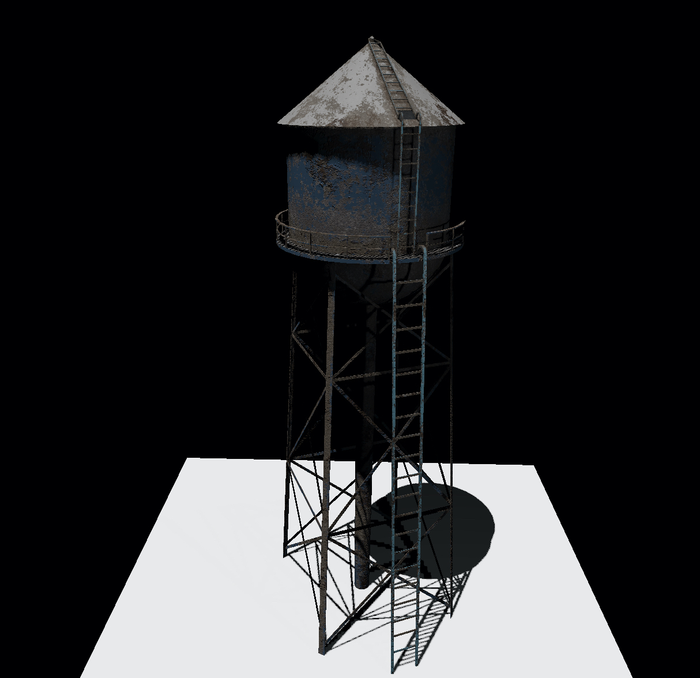
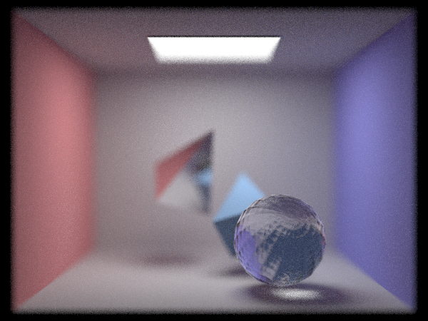

A playground to test my patience.

<br/>

<br/>

[the capture file is here](img/9-19-capture.rdc)

2k environment map downloaded from [Poly Haven](https://polyhaven.com/hdris)

---

## Features

Common Vulkan utilities to save my sanity: abstraction classes, validation layer, debug draw,etc. 

Dear ImGui and RenderDoc integration

Loading gLTF scenes and basic scene management
* With a Blender addon to make my workflow easier 
* Automatic hot reload when asset files change

A variety of rendering paths that can be modified/extended into more variants:
* Simple forward
* PBR deferred with many post-processing options 
  * HDR, tone mapping, gamma correction, exposure compensation
  * environment maps
* CPU path tracing with optional SIMD acceleration using Intel ISPC
  * basic optimizations (BVH, direct light rays, Russian Roulette, [correlated multi-jittered sampling](https://graphics.pixar.com/library/MultiJitteredSampling/paper.pdf) within each pixel, cosine-weighted importance sampling)
  * SIMD-specific optimizations that were part of my CMU-15418 final project, see [pathtracer-standalone branch](https://github.com/miyehn/niar/tree/pathtracer-standalone)
  * diffuse, mirror and glass materials
  * image-based lighting
  * depth of field
* Render to file using the path tracer
* RTX pipeline using the `VK_KHR_ray_tracing_pipeline` extension, even though it now just draws a single triangle

Compute shaders

(OpenGL legacy feature, not integrated yet) Procedural grass generation and animation. See [grass-sim branch](https://github.com/miyehn/niar/tree/grass-sim).

(OpenGL legacy feature, now deleted) shadow mapping for point and directional lights

Runs on both PC and Mac

---
<br/>

<br/>

<br/>


<br/>


<br/>
(The above water tower model and its textures are from www.animatedheaven.weebly.com)

<br/>

## Usage

### Run

```
./ellyn
```

WASD to move the camera, E/Q to move up/down. LMB drag to rotate camera. ESC to quit.

When pathtracer is set as the active renderer, camera control is disabled, but instead some pathtracer-specific controls become effective. Look for `PathtracerController` in the scene hierarchy for details.

### Render to file

Something like:
```
./asz -w 200 -h 150 -o output.png
```

### Configuration

See `config/global.ini` for properties that get loaded on program start. It gets loaded once and stays effective for the duration of the program.

There's also `config/pathtracer.ini` that gets loaded when the path tracer initializes. It automatically hot reloads, so I use it for tweaking path tracer settings.
