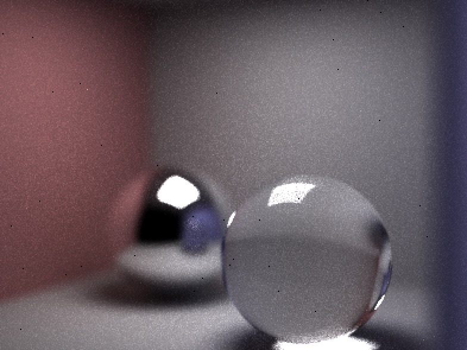
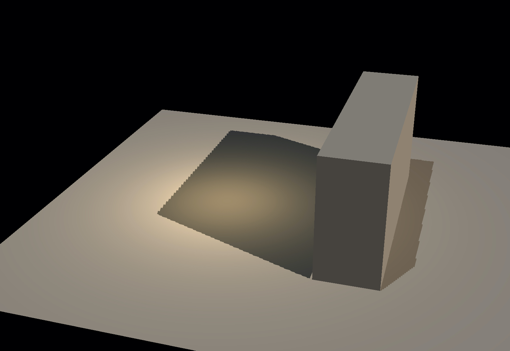

# niar

An playground to test the limit of my patience.

**For offline stuff**, it has a multi-threaded CPU pathtracer; sort of a rebuilt of [Scotty3D](https://github.com/cmu462/Scotty3D)'s pathtracer part from scratch. The actual pathtracing code is mostly in `src/Pathtracer/Pathtracer.inl`.

Can modify `config.ini` to customize some settings to be loaded at program startup (some properties can also be modified at runtime; will document this later)

</img>

**For real-time rendering**, I'm recently working on building a deferred pipeline. Currently it supports only diffuse material, only point and directional lights, and only directional lights can cast shadows (with artifact).

</img>

Also check out the [grass-sim](https://github.com/miyehn/glFiddle/tree/grass-sim) branch (I wrote that part when I had access to a PC and it uses compute shader so it's currently not integrated into master).

